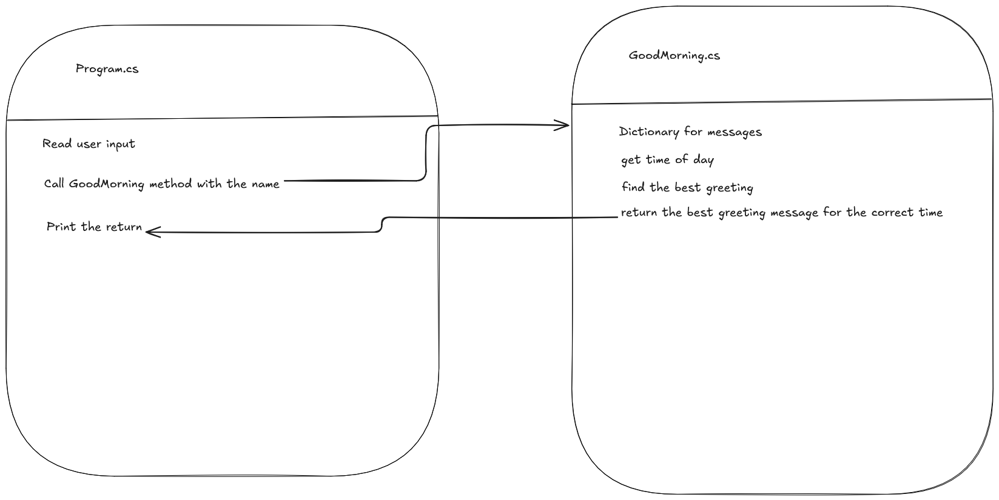

# Greeting Message

### a simple program that writes the correct greeting for the time of day.

the program is using a dictionary from the suggested ways of solving the issue.  
it uses linq to select the correct greeting for the time of day  

 
i dont know if i need the null check or not.
